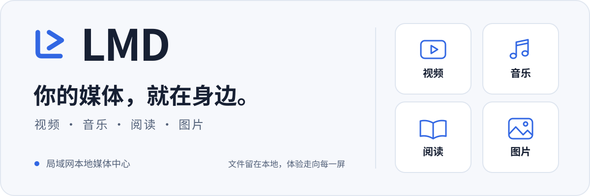

<p align="center">
  <picture>
    <source media="(prefers-color-scheme: dark)" srcset="assets/readme/hero-dark.svg" />
    
  </picture>
</p>

<h1 align="center">LMD · 局域网本地媒体中心</h1>

<p align="center">
  把 Windows 电脑里的收藏，带到同一局域网的每一块屏幕。<br />
  无需域名，浏览器即开即用，媒体文件留在自己的设备上。
</p>

<p align="center">
  <a href="https://github.com/bsygYwjn/LMD/releases/latest"></a>
  
  <a href="LICENSE"></a>
</p>

<p align="center">
  <a href="#quick-start">快速开始</a> ·
  <a href="#features">功能概览</a> ·
  <a href="LMD使用说明.md">使用指南</a> ·
  <a href="#development">源码运行</a> ·
  <a href="https://github.com/bsygYwjn/LMD/issues">反馈问题</a>
</p>

---

<a id="features"></a>

## 一个入口，四种收藏

LMD 在 Windows 10/11 电脑上运行，通过局域网向 Android、iPhone、iPad、Windows 和 macOS 浏览器提供媒体库。视频、音乐、阅读和图片各有独立目录，保留磁盘上的真实文件夹层级。

| 媒体库 | 可以做什么 | 常见格式 |
| :--- | :--- | :--- |
| **视频** | 按文件夹浏览、自动识别选集、拖动进度、外挂与内嵌字幕、兼容副本 | MP4、MKV、MOV、WebM 等；SRT / ASS / SSA 字幕 |
| **音乐** | 无损播放、专辑封面、滚动歌词、播放队列、全局迷你播放器 | FLAC、WAV、AIFF、APE、WavPack、MP3、AAC 等 |
| **阅读** | 电子书封面与阅读进度、PDF 阅读、电子书排版、表格快速预览 | PDF、EPUB、MOBI、AZW3、TXT 等；XLSX、CSV、ODS 等 |
| **图片** | 瀑布流、缩放查看、方向键切图、单张与批量保存原图 | JPG、PNG、GIF、WebP、AVIF、TIFF 等 |

- **原文件保持原样**：扫描、字幕、封面、缩略图与兼容处理使用独立缓存，不改写媒体原件。
- **各块屏幕都顺手**：适配手机、平板和桌面，支持浅色与深色主题；音乐可在切换媒体库时继续播放。
- **双击启动，扫码访问**：Windows 托盘提供服务启停、管理入口、局域网地址与二维码，支持登录 Windows 后自动启动。
- **按需开启访问控制**：默认免登录；开启后，用六位数字访问码和文件夹分类分配不同用户的可见范围。
- **媒体库自动更新**：默认每 30 秒扫描一次已添加目录，也可以手动刷新；扫描间隔可在管理端调整。

<a id="quick-start"></a>

## 快速开始

### 下载发布包

从 [Releases](https://github.com/bsygYwjn/LMD/releases/latest) 下载 **`LMD_V*.zip` 完整发布包**，解压到 Windows 电脑。发布包包含运行时和已构建网页，普通使用无需安装开发工具。

> GitHub 自动生成的 **Source code (zip / tar.gz)** 是源码，不含运行时、FFmpeg 和构建产物。使用源码请看[源码运行](#development)。

1. **启动 LMD** — 双击 `启动LMD.vbs`，系统托盘会显示 LMD 图标并打开控制面板。
2. **添加收藏** — 打开控制面板中的本机管理页，为视频、音乐、阅读或图片添加目录并扫描。
3. **拿起另一台设备** — 连接同一局域网，扫描控制面板里的二维码，或输入显示的观看端地址。

| 入口 | 地址 | 在哪里使用 |
| :--- | :--- | :--- |
| 本机管理端 | `http://127.0.0.1:8096/admin` | 运行 LMD 的 Windows 电脑 |
| 观看端 | `http://<服务器局域网 IP>:8096` | 同一局域网内的手机、平板或电脑 |
| 健康检查 | `http://127.0.0.1:8096/api/health` | 在服务器电脑确认服务是否正常 |

后续左键点击托盘图标可再次打开控制面板。开机自启、扫描设置、兼容副本位置和 FFmpeg 安装 / 更新都在管理端的“运行设置”中。

<a id="access"></a>

## 分享给家人，也能分配范围

默认打开观看端即可浏览。需要区分用户时，在本机管理端开启“访问控制”，为文件夹分配分类，再生成访问码并选择允许访问的分类。

- 每个六位访问码对应一个用户，无需再填写用户名。
- 目录、封面、字幕和媒体直链都会在服务端检查权限。
- 重置访问码、禁用或删除用户会使其现有登录失效。
- 管理页面与管理接口仅允许服务器本机访问；局域网设备访问 `/admin` 会收到 `403`。

LMD 面向可信局域网，使用 HTTP。请勿将 `8096` 端口转发到公网；Windows 防火墙首次询问时，只允许可信的专用网络。完整规则见[使用指南 · 访问规则](LMD使用说明.md#访问规则)。

## 开始使用前，了解这些边界

<details>
<summary><strong>视频兼容性、HDR 与字幕</strong></summary>

能扫描到文件，不代表每个浏览器都能解码它。实际播放取决于设备对容器、视频编码、音频编码、10-bit 与 HDR 的支持。

LMD 可自动生成兼容副本：视频码流直接复制，不重新编码；不兼容音频可能转换为 AAC，因此这类音频转换并非无损。设备不支持原视频编码时，仅重封装仍无法解决，当前版本不自动转码视频。

SRT 使用浏览器字幕轨，ASS / SSA 使用 JASSUB 与 libass WebAssembly 保留样式；支持提取内嵌文本字幕与字体。图片型字幕（如 PGS）暂不支持。

</details>

<details>
<summary><strong>无损音乐与移动端后台播放</strong></summary>

浏览器不易直接播放的无损格式会生成经过 PCM 一致性校验的 FLAC 兼容副本，不生成新的 AAC / MP3 有损副本。

音乐支持锁屏封面、耳机按键和后台播放；具体行为取决于浏览器与操作系统。

</details>

<details>
<summary><strong>表格预览、阅读进度与图片下载</strong></summary>

表格用于快速预览，不执行宏，也不提供编辑或公式重算。图表、图片、数据透视表和复杂样式不在预览范围内。表格上限为 64 MiB，TXT 上限为 16 MiB；超限文件可下载后在本地打开。

阅读进度保存在当前浏览器，不跨设备同步。局域网 HTTP 下，图片批量保存会回退为逐张下载，不生成 ZIP；支持的安全 Chromium 环境可选择目录并流式保存。

</details>

<details>
<summary><strong>多设备同时播放</strong></summary>

服务端最多允许 10 路音视频同时传输，电子书与表格读取不占用该配额。实际体验取决于文件码率、硬盘、网络与客户端解码能力；尚未用十台真实设备完成长期压力测试。

</details>

<a id="development"></a>

## 从源码运行

需要 **Node.js 22.13+（22.x）或 24+**、**pnpm 11.19.0** 和 Git。项目使用 `pnpm-lock.yaml` 及 `pnpm-workspace.yaml` 中的依赖补丁，请使用 pnpm 安装。

```powershell
git clone https://github.com/bsygYwjn/LMD.git
cd LMD
npm install --global pnpm@11.19.0
pnpm install --frozen-lockfile
pnpm build
pnpm server
```

启动后打开 `http://127.0.0.1:8096/admin` 添加目录。源码仓库不包含 FFmpeg，可在管理端“运行设置 → MEDIA ENGINE”中安装；安装与更新需要联网。

| 命令 | 用途 |
| :--- | :--- |
| `pnpm dev` | 启动前端开发服务器 `http://127.0.0.1:5173`，需另开终端运行 `pnpm server` |
| `pnpm build` | TypeScript 检查并构建网页到 `dist/` |
| `pnpm server` | 启动共享服务，默认监听 `0.0.0.0:8096` |
| `pnpm test:all` | 运行服务端回归测试 |

普通服务读取 `dist/`，修改前端源码后需要重新构建。测试使用临时数据目录与独立端口。

<details>
<summary><strong>项目结构</strong></summary>

```text
src/                 React 界面：视频、音乐、阅读、图片与管理端
server/              Node.js 服务：扫描、权限、媒体直传与兼容处理
public/              网页静态资源
assets/brand/        LMD 品牌母版与图标
assets/readme/       README 品牌横幅
patches/             锁定依赖的兼容补丁
tools/               品牌资源生成等工具
tray.ps1             Windows 托盘控制器
启动LMD.vbs          Windows 双击启动入口
LMD使用说明.md       完整功能说明与排障指南
LICENSE              GNU AGPL v3.0 许可证
```

`data/` 是本机状态与缓存，`runtime/` 是本地运行时，`tools/ffmpeg/` 是媒体工具，`dist/` 是构建产物；这些目录不提交到 Git。

</details>

## 使用指南与反馈

- **使用说明**：[完整指南](LMD使用说明.md)，包括字幕匹配、选集识别、扫描、重封装、访问控制与故障排查。
- **页面打不开**：先在服务器电脑检查健康接口，再核对两台设备的网络与防火墙；手机应使用服务器局域网 IP，不能使用 `127.0.0.1`。
- **问题反馈**：[提交 Issue](https://github.com/bsygYwjn/LMD/issues/new)，附上版本、设备、浏览器和复现步骤；播放问题请补充容器与编码信息。
- **参与改进**：欢迎提交 Pull Request。代码修改请附验证结果，界面修改可附截图。

## 品牌与致谢

由 **bsygYwjn** 与 **Codex** 共同开发。LMD 的两条圆角折线呼应本地媒体库、播放与共享，在网页、浏览器图标和 Windows 托盘中保持一致。品牌蓝为 `#3267E3`，资源与生成方法见[品牌使用说明](assets/brand/README.md)。

感谢 React、Vite、FFmpeg、JASSUB / libass、Foliate JS、PDF.js、SheetJS 等开源项目。

本 README 的信息组织与排版参考了 [Immich](https://github.com/immich-app/immich/blob/main/README.md)、[Jellyfin](https://github.com/jellyfin/jellyfin/blob/master/README.md) 和 [Vite](https://github.com/vitejs/vite/blob/main/README.md)。

<a id="license"></a>

## 许可证

LMD 采用 **GNU Affero General Public License v3.0**，SPDX 标识为 **`AGPL-3.0-only`**。完整条款见 [LICENSE](LICENSE)，官方说明见 [GNU AGPL v3.0](https://www.gnu.org/licenses/agpl-3.0.html)。

第三方依赖与随附工具保留各自的许可证。

## 视频播放核心

播放按“尽量不动原片”的顺序自动选择：**原文件直传 → 换容器（音视频都复制）→ 只转不兼容的轨道 → 整体转换**。

- MP4 + H.264 + AAC 等浏览器能直接播放的组合使用原文件 Range 传输，不启动 FFmpeg。
- MKV + H.264 + AAC 并且设备支持这两种编码时音视频双 Copy，只换容器，画质与码流不变。
- 只有确实无法解码的轨道才会被编码：例如 DTS 音频只转 AAC，视频保持 Copy。
- HEVC、AV1、VP9 等设备能解的原始编码优先保留；HDR 必须转码时执行 HDR→SDR 映射。
- 兼容数据按需生成、传输、缓存和释放，默认不再生成长期保存的完整兼容副本；原视频永久保留。
- 播放缓存容量、保留时间、缓冲与租约可在“运行设置”里调整，默认上限 10 GiB、保留 6 小时。

播放核心的模块、接口、配置与验收方式见 [docs/播放核心开发说明.md](docs/播放核心开发说明.md)、[docs/播放核心接口说明.md](docs/播放核心接口说明.md)、[docs/播放核心配置与迁移说明.md](docs/播放核心配置与迁移说明.md) 与 [docs/播放核心测试报告.md](docs/播放核心测试报告.md)。
